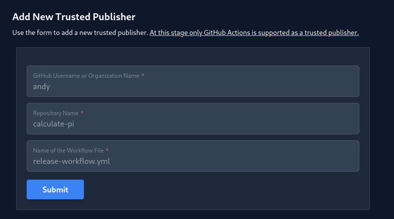

# Server authentication

## Authenticating with a server

You may want to use private channels for which you need to be authenticated. To
do this ephemerally you can use the `RATTLER_AUTH_FILE` environment variable to
point to a JSON file with the following structure:

```json
{
    "*.prefix.dev": {
        "BearerToken": "your_token"
    },
    "otherhost.com": {
        "BasicHTTP": {
            "username": "your_username",
            "password": "your_password"
        }
    },
    "anaconda.org": {
        "CondaToken": "your_token"
    },
    "s3://my-bucket/my-channel": {
        "S3Credentials": {
            "access_key_id": "your_access_key_id",
            "secret_access_key": "your_secret_access_key",
            "session_token": null
        }
    }
}
```

The keys are the host names. You can use wildcard specifiers here (e.g.
`*.prefix.dev` to match all subdomains of `prefix.dev`, such as
`repo.prefix.dev`). This will allow you to also obtain packages from any private
channels that you have access to.

The following known authentication methods are supported:

- `BearerToken`: prefix.dev
- `CondaToken`: anaconda.org, quetz
- `BasicHTTP`: artifactory
- `S3Credentials`: S3 buckets

## Uploading packages

If you want to upload packages, then rattler-build comes with a built-in
`upload` command. There are the following options:

- `prefix.dev`: you can create public or private channels on the prefix.dev
  hosted server
- `anaconda.org`: you can upload packages to the free anaconda.org server
- `quetz`: you can host your own quetz server and upload packages to it
- `artifactory`: you can upload packages to a JFrog Artifactory server
- `s3`: you can upload packages to an S3 bucket

The command is:

```bash
rattler-build upload <server> <package_files>
```

Note: you can also use the `RATTLER_AUTH_FILE` environment variable to
authenticate with the server.

### prefix.dev

#### Trusted publishing via OIDC

`rattler-build` supports authentication with <https://prefix.dev> through OIDC with GitHub Actions.
An API key is no longer required, rattler-build can manage the complete authentication workflow for you.
You only have to set up a specific repository and workflow under "Trusted Publishers" on prefix.dev.



Here you can find an example GitHub Actions workflow

```yaml title=".github/workflows/build.yml"
permissions:
  contents: read
  id-token: write

jobs:
  build:
    runs-on: ubuntu-latest
    steps:
      - uses: actions/checkout@v4
      - name: Build conda package
        uses: prefix-dev/rattler-build-action@v0.2.19

      - name: Upload all packages
        shell: bash
        run: |
          shopt -s nullglob
          EXIT_CODE=0
          for pkg in $(find output -type f \( -name "*.conda" -o -name "*.tar.bz2" \) ); do
            if ! rattler-build upload prefix -c my-channel "${pkg}"; then
              EXIT_CODE=1
            fi
          done
          exit $EXIT_CODE
```

#### Token

To upload to [prefix.dev](https://prefix.dev), you need to have an account.
You can then create a token in the settings of your account. The token is used
to authenticate the upload.

```bash
export PREFIX_API_KEY=<your_token>
rattler-build upload prefix -c <channel> <package_files>
```

You can also use the `--api-key=$PREFIX_API_KEY` option to pass the token
directly to the command. Note that you need to have created the channel on the
prefix.dev website before you can upload to it.

### Quetz

You need to pass a token and API key to upload to a channel on your own Quetz
server. The token is used to authenticate the upload.

```bash
export QUETZ_API_KEY=<your_token>
rattler-build upload quetz -u <url> -c <channel> <package_files>
```

### Artifactory

To upload to an Artifactory server, you need to pass a username and password.
The username and password are used to authenticate the upload.

```bash
export ARTIFACTORY_USERNAME=<your_username>
export ARTIFACTORY_PASSWORD=<your_password>
rattler-build upload artifactory -u <url> -c <channel> <package_files>
```

### anaconda.org

To upload to [anaconda.org](https://anaconda.org), you need to specify the owner
and API key. The API key is used to authenticate the upload.

The owner is the owner of the distribution, for example, your user name or
organization.

One can also specify a label such as `dev` for release candidates using the
`-c` flag. The default value is `main`.

You can also add the `--force` argument to forcibly upload a new package (and
overwrite any existing ones).

```bash
export ANACONDA_API_KEY=<your_token>
rattler-build upload anaconda -o <your_username> -c <label> <package_files>
```

### S3

To upload to an S3 bucket, you need to set access key ID, secret access key and (optionally) a session token.
If not using `rattler-build auth login s3://my-bucket --s3-access-key-id <access-key-id> --s3-secret-access-key <secret-access-key> --s3-session-token <session-token>`, you can set the corresponding `AWS_*` environment variables (even if not using AWS S3).
For instance, the following example uploads to a Cloudflare R2 S3 bucket:

```bash
export AWS_ACCESS_KEY_ID=<your_access_key_id>
export AWS_SECRET_ACCESS_KEY=<your_secret_access_key>
rattler-build upload s3 \
  --channel s3://my-bucket/my-channel \
  --region auto \
  --endpoint-url https://xyz.r2.cloudflarestorage.com \
  --force-path-style
```
