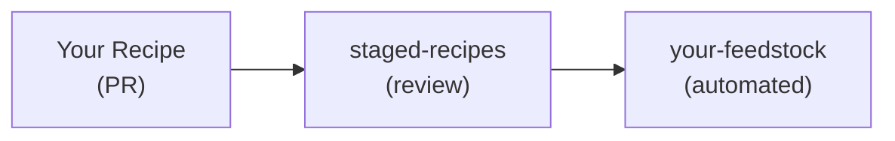

# Publishing to conda-forge

[conda-forge](https://conda-forge.org/) is a community-driven collection of recipes and packages
for the conda ecosystem. Publishing your package to conda-forge makes it available to millions
of users via `conda install -c conda-forge <package>`.

## Overview

The conda-forge workflow consists of two phases:

1. **Initial submission**: Submit your recipe to [staged-recipes](https://github.com/conda-forge/staged-recipes)
2. **Maintenance**: After approval, your recipe moves to its own "feedstock" repository



## Prerequisites

Before submitting to conda-forge:

- Your package should be publicly available (GitHub, PyPI, crates.io, etc.)
- You have a working `recipe.yaml` that builds successfully with `rattler-build`
- The package has an OSI-approved open source license

## Step 1: Prepare your recipe

conda-forge uses the same recipe format as `rattler-build`. If you've already built your
package locally, you're most of the way there.

### Recipe location

Place your recipe in a folder named after your package:

```
recipes/
└── my-package/
    └── recipe.yaml
```

### Required fields

Ensure your recipe includes all required metadata:

```yaml title="recipe.yaml"
context:
  version: "1.2.3"

package:
  name: my-package
  version: ${{ version }}

source:
  url: https://github.com/owner/repo/archive/v${{ version }}.tar.gz
  sha256: abc123...

build:
  number: 0
  script: python -m pip install . -vv  # example for Python

requirements:
  host:
    - python
    - pip
  run:
    - python

tests:
  - python:
      imports:
        - my_package

about:
  homepage: https://github.com/owner/repo
  license: MIT
  license_file: LICENSE
  summary: Short description of the package
  description: |
    Longer description of what the package does.
  repository: https://github.com/owner/repo
  documentation: https://my-package.readthedocs.io

extra:
  recipe-maintainers:
    - your-github-username
```

### Important considerations

- **License**: Use [SPDX identifiers](https://spdx.org/licenses/) and include the license file
- **Tests**: Include meaningful tests that verify the package works
- **Maintainers**: List GitHub usernames of people who will maintain the recipe
- **Pinning**: Don't pin exact versions unless necessary; conda-forge manages pinnings in the [conda-forge pinnings](https://github.com/conda-forge/conda-forge-pinning-feedstock).

## Step 2: Submit to staged-recipes

1. **Fork** the [staged-recipes repository](https://github.com/conda-forge/staged-recipes)

2. **Create a branch** for your recipe:
   ```bash
   git checkout -b add-my-package
   ```

3. **Add your recipe** to the `recipes/` directory:
   ```
   staged-recipes/
   └── recipes/
       └── my-package/
           └── recipe.yaml
   ```

4. **Test locally** before submitting:
   ```bash
   rattler-build build --recipe recipes/my-package/recipe.yaml
   ```

5. **Push and create a PR** to the main staged-recipes repository

### PR checklist

The PR template includes a checklist. Key items:

- [ ] License file is included in the package
- [ ] Recipe builds on all target platforms
- [ ] Tests are included and pass
- [ ] Recipe follows conda-forge guidelines
- [ ] You've added yourself as a maintainer

## Step 3: Review process

After submitting:

1. **Automated checks** run to verify the recipe builds
2. **conda-forge reviewers** review your recipe (usually within a few days)
3. **Address feedback** - reviewers may request changes
4. **Approval and merge** - once approved, your PR is merged

### Common review feedback

- Missing or incorrect license information
- Tests that don't adequately verify the package
- Unnecessary version pinning
- Missing dependencies
- Platform-specific issues

## Step 4: Your feedstock

After your PR is merged:

1. A new repository `conda-forge/my-package-feedstock` is automatically created
2. You're added as a maintainer with write access
3. Builds are triggered automatically for all platforms
4. Packages are published to the `conda-forge` channel

## Maintaining your feedstock

### Updating versions

When a new version is released:

1. Create a PR to your feedstock updating `recipe.yaml`
2. Update the version and sha256 checksum
3. Reset build number to 0
4. CI builds and publishes automatically after merge

You can use `rattler-build bump-recipe` to help:

```bash
rattler-build bump-recipe --recipe recipe.yaml --version 1.2.4
```

### Automated version updates

conda-forge has bots that can automatically create PRs when new versions are detected:

- **regro-cf-autotick-bot**: Detects new versions on PyPI, GitHub releases, etc.
- **Version updates**: Bot creates PRs that you can review and merge

### Rebuilding packages

To rebuild with updated dependencies (without a version change):

1. Increment the `build.number` in your recipe
2. Create a PR to your feedstock
3. Merge after CI passes

## Tips for success

### Use noarch when possible

For pure Python packages, use `noarch: python`:

```yaml
build:
  noarch: python
```

This builds once and works on all platforms, reducing CI time and maintenance.

### Handle platform differences

Use selectors for platform-specific logic:

```yaml
requirements:
  run:
    - if: win
      then: pywin32
    - if: unix
      then: pexpect
```

### Pin to conda-forge packages

Prefer dependencies from conda-forge over system libraries:

```yaml
requirements:
  host:
    - openssl  # from conda-forge, not system
```

## Resources

- [conda-forge documentation](https://conda-forge.org/docs/)
- [staged-recipes repository](https://github.com/conda-forge/staged-recipes)
- [conda-forge Zulip chat](https://conda-forge.zulipchat.com/)
- [Recipe format reference](reference/recipe_file.md)
